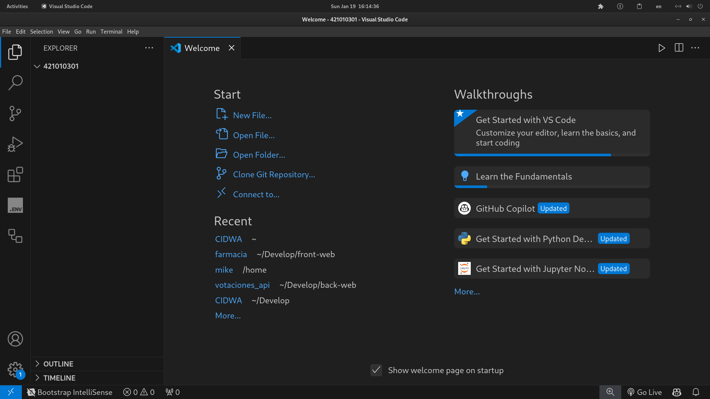

# **Módulo 3: Introducción a Visual Studio Code**

---

Primero y antes que nada, debemos crear nuestro directorio de trabajo donde llevaremos a cabo nuestras prácticas.

## **Pasos a seguir:**

1. **Abrir una terminal:**
   - Usa el atajo de teclado: `Ctrl + T` (o abre la terminal de tu sistema manualmente).

2. **Inspeccionar los directorios disponibles:**
   - Ejecuta el siguiente comando en la terminal:
     ```bash
     ls
     ```
   - Esto mostrará una lista de los directorios disponibles.

3. **Acceder a la carpeta de trabajo:**
   - Usa el comando `cd` para navegar hasta la carpeta de **CIDWA** (si no está creada, debes crearla).
   - Comando para crearla si no existe:
     ```bash
     mkdir CIDWA
     ```
   - Accede a la carpeta:
     ```bash
     cd CIDWA
     ```

4. **Crear una carpeta con tu número de cuenta:**
   - Dentro del directorio **CIDWA**, crea una nueva carpeta utilizando tu número de cuenta:
     ```bash
     mkdir [TuNumeroDeCuenta]
     ```

5. **Abrir el directorio en Visual Studio Code:**
   - Usa el comando `code` para abrir la carpeta recién creada en VSCode:
     ```bash
     code [TuNumeroDeCuenta]
     ```

### **Ejemplo Completo de Comandos:**
```bash
Ctrl + T
ls
mkdir CIDWA
cd CIDWA
mkdir 12345678  # Reemplaza con tu número de cuenta
cd 12345678
code 12345678
```

Una vez que accedas a vscode veras algo como esto:



## **Explicación de los elementos principales de la imagen**

1. **Explorador de archivos (Explorer)**
   - En el panel izquierdo, se ve la sección llamada **Explorer**, donde aparece el contenido del directorio de trabajo.
   - En este caso, el directorio principal abierto se llama `421010301`, que probablemente es una carpeta creada previamente (como se sugirió en los pasos).
   - Este panel te permite navegar por los archivos y carpetas de tu proyecto.

2. **Iconos en la barra lateral izquierda**
   - Los iconos en la barra lateral proporcionan acceso rápido a diferentes funcionalidades:
     - **Explorer:** Gestionar archivos y carpetas del proyecto.
     - **Search:** Buscar dentro del proyecto.
     - **Source Control:** Configurar sistemas de control de versiones como Git.
     - **Run and Debug:** Ejecutar y depurar el código.
     - **Extensions:** Instalar extensiones para ampliar las capacidades de VSCode.

Excelente explicación. Aquí tienes una versión ampliada y ajustada para que sea más clara y útil para tus estudiantes:

---

### **3. Barra Superior**
La barra superior en Visual Studio Code contiene varios menús útiles para realizar distintas tareas. En este caso, nos centraremos en el menú **Terminal**, que permite abrir una terminal integrada directamente en el editor.

#### **Abrir una nueva terminal**
1. Haz clic en el menú **Terminal** en la barra superior.
2. Selecciona la opción **New Terminal** (Nueva Terminal) del menú desplegable.
3. Una terminal aparecerá automáticamente en la parte inferior del editor de VSCode.


La terminal integrada en VSCode funciona igual que una terminal estándar de tu sistema operativo.

### **Creando archivos y carpetas en Visual Studio Code**

En esta sección aprenderás a crear archivos y carpetas directamente desde el **Explorador de Archivos** en Visual Studio Code, utilizando la interfaz gráfica.

---

### **Actividad sugerida**
1. Crea un **archivo** dentro de la carpeta de tu número de cuenta llamado `tarea.txt`.
2. Crea una nueva **carpeta** dentro de la misma carpeta de tu número de cuenta llamada `proyecto`.
3. Dentro de la carpeta `proyecto`, crea un archivo llamado `notas.md`.

---

### **Resultado esperado**
Al finalizar, tu Explorador de Archivos debería lucir algo similar a esto:

```
421010301/
├── tarea.txt
└── proyecto/
    └── notas.md
```

---

### **Notas adicionales**
- **Renombrar archivos o carpetas:** Haz clic derecho sobre un archivo o carpeta y selecciona **Rename** para cambiar su nombre.
- **Eliminar archivos o carpetas:** Haz clic derecho y selecciona **Delete**. Asegúrate de no borrar archivos importantes por accidente.

Esto te permitirá organizar tus proyectos de manera eficiente y empezar a trabajar directamente desde Visual Studio Code.