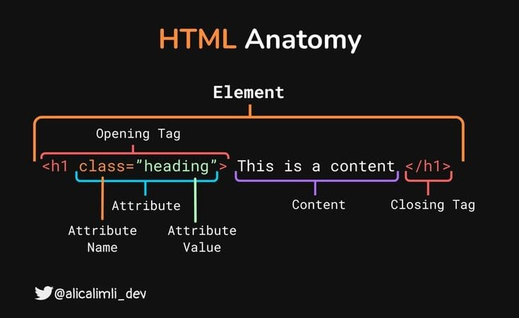

# Módulo 1: Introducción a HTML

## **¿Qué es HTML y para qué se utiliza?**

**HTML** (HyperText Markup Language) es el lenguaje estándar de marcado utilizado para estructurar y presentar contenido en la web. Es la base de cualquier página web y define cómo se organiza y muestra la información, permitiendo que los navegadores interpreten y rendericen el contenido de manera visual para los usuarios.

---

### **Características clave de HTML**:
1. **Lenguaje de marcado**: Utiliza etiquetas o elementos para definir diferentes partes del contenido, como títulos, párrafos, imágenes, enlaces, tablas, y más.
2. **No es un lenguaje de programación**: No incluye lógica ni capacidad para realizar cálculos o interacciones avanzadas. Para ello se utiliza en combinación con lenguajes como JavaScript.
3. **Estandarizado**: Es mantenido por el W3C (World Wide Web Consortium), lo que garantiza que sea compatible con la mayoría de navegadores.
4. **Base de otros lenguajes**: Trabaja junto con CSS (para el diseño) y JavaScript (para la interactividad).

---

### **Ejemplo básico de un documento HTML**:

```html
<!DOCTYPE html>
<html lang="en">
    <head>
        <meta charset="UTF-8" />
        <meta name="viewport" content="width=device-width, initial-scale=1.0" />
        <title>Mi Primera Página</title>
    </head>
    <body>
        <h1>¡Hola, Mundo!</h1>
        <p>Este es un párrafo de ejemplo en HTML.</p>
        <a href="https://example.com"
            >Haz clic aquí para visitar un sitio web
        </a>
    </body>
</html>
```

**Explicación**:
- `<!DOCTYPE html>`: Declara que se trata de un documento HTML5.
- `<html>`: Raíz del documento.
- `<head>`: Contiene metadatos sobre la página (como el título).
- `<body>`: Contiene el contenido visible de la página (texto, enlaces, etc.). 

